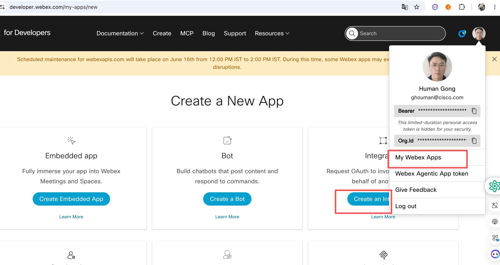
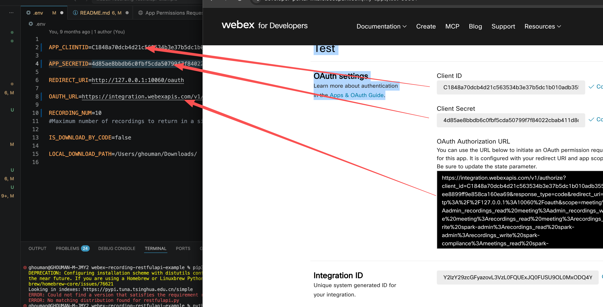

# webex-recording-restfulapi-example

A small Flask demo that uses the Webex REST APIs to:

1. List spaces and meeting recordings for the signed-in user (or, with admin
   scopes, for the whole org).
2. Optionally download each recording to disk.
3. **Bulk-delete converged recordings before a cutoff date** using the batch
   `softDelete` + `purge` endpoints (up to 100 ids per call).

---

## Prerequisites

- Python 3.x
- A Webex integration (Client ID / Secret) — create one at
  <https://developer.webex.com/> and copy its OAuth URL.




**Redirect URI** in the integration settings must be
`http://127.0.0.1:10060/oauth` (or `https://YOUR_SERVER/oauth` if you host
this elsewhere).

## Setup

1. Copy your integration's `Client ID`, `Client Secret`, and `OAuth URL` into
   `.env`. If you want recordings downloaded to disk by the backend, also set
   `IS_DOWNLOAD_BY_CODE=true` and `LOCAL_DOWNLOAD_PATH=/some/path/`.
2. Install dependencies:
   ```
   pip install -r requirements.txt
   ```
3. Run the server:
   ```
   python3 restfulapi.py
   ```
4. Open <http://127.0.0.1:10060> and follow the prompts to authenticate.

---

## Feature: Bulk-delete Converged Recordings before a cutoff date

After signing in via OAuth, the granted page exposes a red button:

**Bulk Delete All Converged Recordings Before Cutoff** — deletes every
`/admin/convergedRecordings` your org owns created on or before the chosen
cutoff date, using the two batch endpoints (100 ids per call):

- `POST /v1/convergedRecordings/softDelete` — moves recordings to the recycle bin.
- `POST /v1/convergedRecordings/purge` — permanently removes them from the recycle bin.

### How it works

For each 30-day window walking back from `cutoff_date` (the Webex admin list
endpoint requires the `from`/`to` interval to be ≤ 30 days):

1. List the window:
   `GET /v1/admin/convergedRecordings?status=available&max=100&from=...&to=...`
2. `softDelete` the returned ids in one batch call.
3. If `purge_after=true` (default), `purge` the same ids in one batch call.
4. Re-list the same window and repeat until it is empty.
5. Shift the window back another 30 days and repeat, up to `months_back` times
   (default `12` ≈ 1 year of history).


### Required role & scopes

- **Admin or Compliance Officer** role on the Webex org.
- OAuth scopes: `spark-admin:recordings_read`, `spark-admin:recordings_write`,
  `spark-compliance:recordings_read`, `spark-compliance:recordings_write`
  (already included in the default OAuth URL in `templates/temp.html`).

> ⚠ **Deletion is permanent** when `purge_after=true` (the default). A
> confirmation dialog is shown before the request is fired — double-check the
> cutoff date before clicking.
